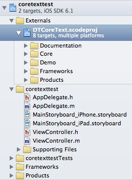
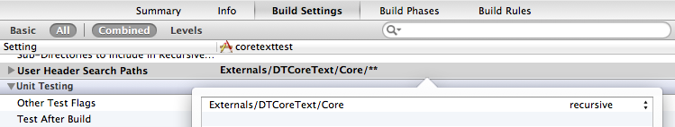
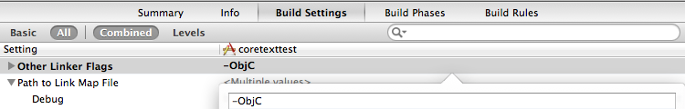

Setup Guide
===========

You have multiple options available for integrating DTCoreText into your own apps. Ranked from most to least convenient they are:

- [Using Swift Package Manager](#SwiftPackageManager)
- [As Sub-Project and/or Git Submodule](#Subproject)
- [As Framework](#Framework)

GitHub offers tar balls for the individual tagged versions, but current DTCoreText v2 checkouts are self-contained and no longer require bundled external repositories.

Requirements
------------

DTCoreText needs a minimum iOS deployment target of iOS 4.2 because of:

- NSCache
- GCD-based threading and locking
- Blocks
- ARC

Support for OS X is currently being developed.

Integrating via Swift Package Manager
-------------------------------------

DTCoreText now ships as a Swift package.

### In Xcode

Use **File > Add Package Dependencies…** and add:

    https://github.com/Cocoanetics/DTCoreText.git

Then add the `DTCoreText` library product to your target.

### In Package.swift

Add DTCoreText as a dependency:

    .package(url: "https://github.com/Cocoanetics/DTCoreText.git", branch: "develop")

and depend on the product from your target:

    .product(name: "DTCoreText", package: "DTCoreText")

Swift Package Manager is the recommended integration path for current versions of DTCoreText.

Integrating via Sub-Project
---------------------------

This is the recommended approach as it lets Xcode see all the project symbols and dependencies.

If you use `git` as SCM of your apps you can add DTCoreText as a submodule, or simply clone it into any folder in your workspace. The repo URL can either be the master repository or, if you plan to [contribute to it](http://www.cocoanetics.com/2012/01/github-fork-fix-pull-request/), your fork.

### Getting the Files

The process of getting the source files of DTCoreText differs slightly whether or not you use `git` for your project's source code management.

#### As Git Submodule

You add DTCoreText as a submodule:

    git submodule add https://github.com/Cocoanetics/DTCoreText.git Vendor/DTCoreText

Now you have a clone of DTCoreText in `Vendor/DTCoreText`.

   
#### As Git Clone

If you don't use git for your project's SCM you clone the project into a folder in your workspace:

    git clone https://github.com/Cocoanetics/DTCoreText.git Vendor/DTCoreText

Now you have a clone of DTCoreText in `Vendor/DTCoreText`.

### Project Setup

You want to add a reference to `DTCoreText.xcodeproj` in your Xcode project so that you can access its targets. You also have to set the header search paths, add some framework/library references and check your linker flags.

#### Adding the Sub-Project

Open the destination project and create a group for external dependencies, for example "Vendor".

Add files… or drag `DTCoreText.xcodeproj` to that group. Make sure to uncheck the Copy checkbox. You want to create a reference, not a copy.

#### Adding Dependencies

Add the following to your application target's Build Phases, under *Link Binary With Libraries*:

- **libDTCoreText.a** (target from the DTCoreText sub-project)
- libxml2.dylib
- ImageIO.framework
- QuartzCore.framework
- CoreText.framework
- MobileCoreServices.framework

Adding libDTCoreText creates an implicit dependency. That means if you are building your app and there is no current lib then Xcode would build it first.

You can move all the additional framework and library links that Xcode adds into your frameworks group.

#### Setting up Header Search Paths

For Xcode to find the headers of DTCoreText add `${TARGET_BUILD_DIR}` to the *Header Search Paths*.

#### Setting Linker Flags

For the linker to be able to find the symbols of DTCoreText, specifically category methods, you need to add the `-ObjC` linker flag:

In Xcode versions before 4.6 you also needed the `-all_load` flag but that appears to no longer be necessary.

#### Resources

DTCoreText uses the `DTCoreTextFontOverrides.plist` to speed up font matching. The version in the Demo App resources has the commonly used font families set up so that it can quickly get the name of a specific font face given font family and the italic and bold settings. It works without this as well, but will be slower. Add your own custom fonts to the plist and include it in your app to make use of this optimization.

The `default.css` stylesheet that is used for defining the default HTML CSS styles. If you want to customize something then please do so via the parse options documented in the [NSAttributedString HTML Category](../../Categories/NSAttributedString+HTML.html).

#### Smoke Test

At this point your project should build and be able to use DTCoreText functionality. As a quick *Smoke Test* - to see if all is setup correctly - you can test your setup by adding this code to your app delegate:

    #import <DTCoreText/DTCoreText.h>

    NSString *html = @"
Some Text
";
    NSData *data = [html dataUsingEncoding:NSUTF8StringEncoding];
    
    NSAttributedString *attrString = [[NSAttributedString alloc] initWithHTMLData:data
                                                               documentAttributes:NULL];
    NSLog(@"%@", attrString);

You should see that this executes and that the NSLog outputs a description of the generated attributed string.

Integrating via Framework
-------------------------

There are two framework targets available in the project:

- **Static Framework** - This is the static universal framework for use with iOS apps
- **Mac Framework** - This is a dynamic framework for use with Mac apps

Both include the headers and when adding them to a project Xcode should set up the header search path accordingly.
